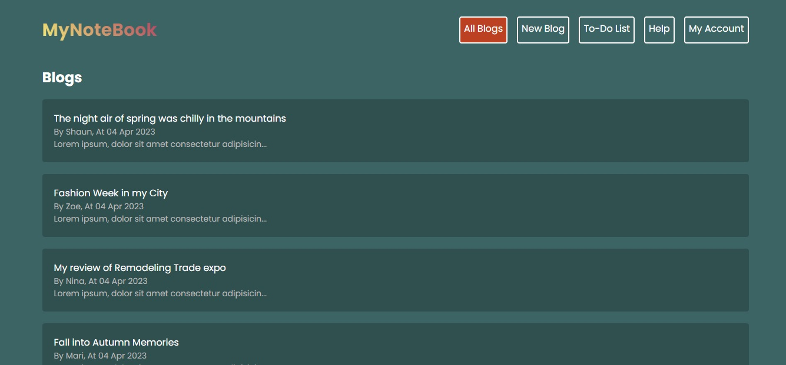
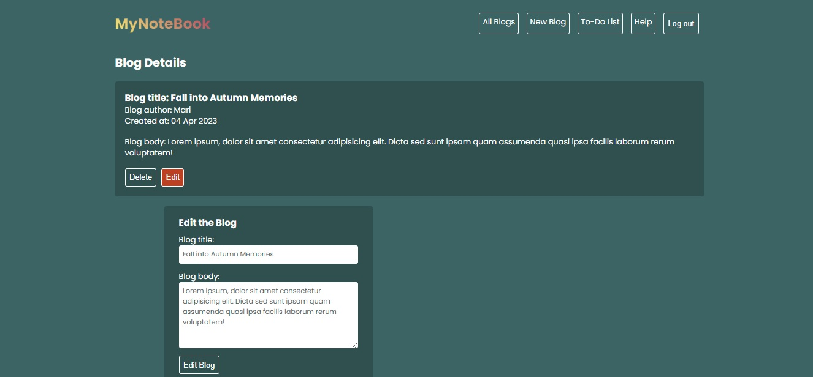
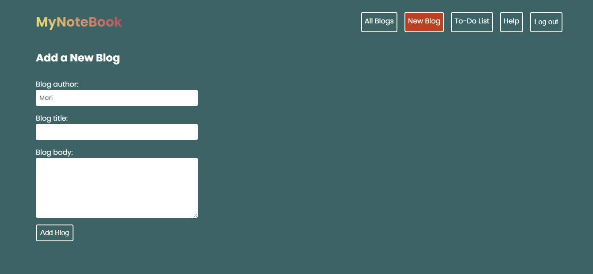
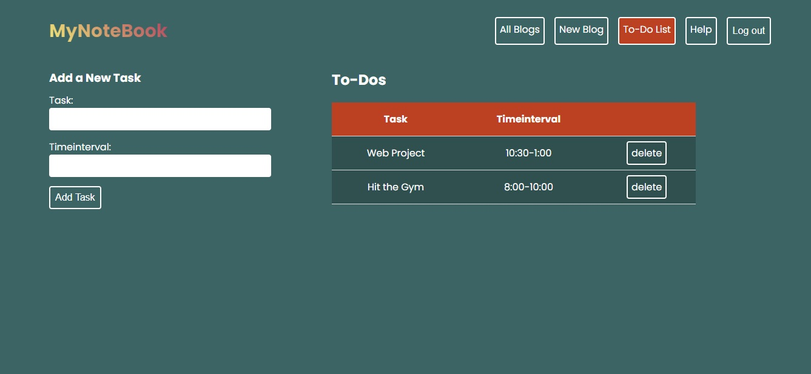
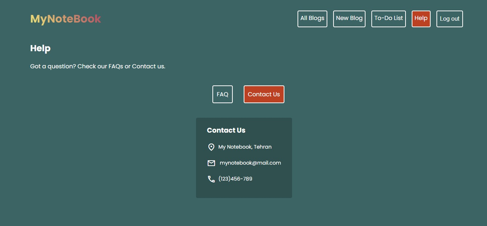
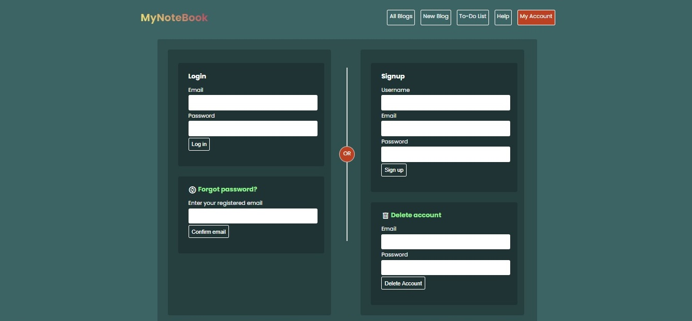

# ReactJS-Blog-ToDoList + Redux Toolkit and RTK Query (<font size='3'> V6: NodeJS, MongoDB, JWT Authentication and Authorization included - a version with JWT Cookie and Access Token</font>)

#### By _**Mahashi-github**_

#### This is a ReactJS, NodeJS and MongoDB application. You can employ this application to create, edit and delete blog posts. You can also create a to-do list of your tasks. There is also a help page containing contact info and FAQs. By employing this application users can create their personal accounts, then the application will grant them permission to post, edit and delete their blogs. This application authenticates you to access its protected routes and authorizes you to post, edit and delete your blogs. There is also a password reset option in case users forget their password. There is also an option for users to delete their accounts. Error handling for signup, login and reset password processes is also provided.  

## Technologies Used
* _ReactJS_
* _React-router-dom (Outlet, useLoaderData, useRouteError, NavLink)_
* _React-Hooks (useEffect, useState)_
* _@reduxjs/toolkit_
* _react-redux_
* _css_
* _jsx_
* _node.js_
* _express_
* _express router & MVC_
* _mongoose_
* _dotenv_
* _validator_
* _bcrypt_
* _jsonwebtoken_
* _cookie-parser_
* _concurrently_

## Setup
This code is made in the following way:
Inside the root derectory:
```
$npm init
$npm create vite@latest frontend
```
Inside the frontend directory:
```
$npm install
```

An env file containing a 'PORT' number, a 'DB_URI' (e.g. mongodb://127.0.0.1:27017/mernstack) variable and an 'ACCESS_TOKEN_SECRET' variable in the root directory is required. To run this project, install it locally:

After cloning the code, you should npm install two times; inside the root and inside the frontend directories.
 
To run the code:
```
$npm run dev
```

To run the backend code:
```
$npm run server
```

To run the frontend code:
```
$npm run client
```

## Screenshots of the Application
<p>
  
  
  
  
  
  
</p>
